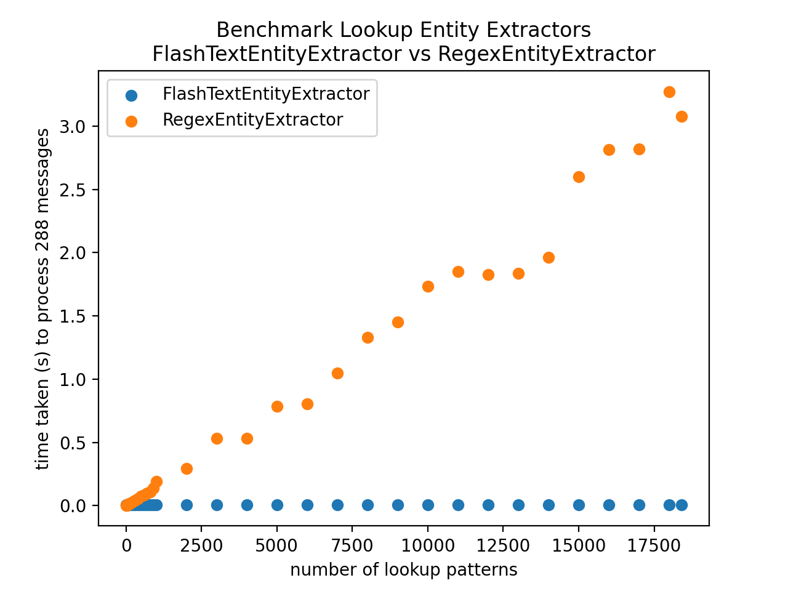

# benchmark-lookup-ee
This repository contains code to benchmark lookup table entity extraction.

## how to run benchmark.py ##
`benchmark.py` will compare the processing time of `RegexEntityExtractor` and `FlashTextEntityExtractor` for varying numbers
of lookup patterns. For each extractor, each message in the test file will be processed.

The range of lookup patterns to test is created as follows:
starting with number of lookups = start (defined by `--start`, default 10) add stepsize until end, where 
stepsize. Include end:
- number of lookups < 100: stepsize = 10
- 99 < number of lookups < 1000: stepsize = 100
- 9999 < number of lookups: stepsize = 1000

The output for the default arguments should look something like this:

### arguments: ###
- `--nlu` this file must contain the lookup table, and at least two nlu training examples for the entity to look up. For
  example, if your lookup pattern is `location`, your `nlu` file must contain two examples (for any intent) with a named
  entity of type `location`, like so: "I would like to visit \[France\](location)"
  
  By default, `nlu.yml` contains a lookup table of names, taken from [rasa-nlu-examples](https://github.com/RasaHQ/rasa-nlu-examples/tree/main/data/namelists/usa).

- `--test` this file contains the messages to process (search for entities). One message per line.

- `--lookup` the name of the entity type (`location`, for example). If you have multiple lookup tables in your `nlu` 
  file (`name`, `location`, for example), this parameter defines which lookup pattern to use for testing. If you do not
  specify, the first lookup pattern will be used.
  
## how to run get_wiki_file.py ##
`get_wiki_file.py` was used to produce `data/tennis_test.txt`. It grabs the text contents of a Wikipedia file, and 
outputs them, one sentence per line for test data. You can use it to produce your own messages to process. 
Alternatively, you can define your own file of messages to process. Each line in the file should be one message.

### arguments: ###
- `--title` is the (case-sensitive!) title of the page you want to grab (default: "History of tennis")
- `--out` is the output filename (default: `data/tennis_test.txt`)
